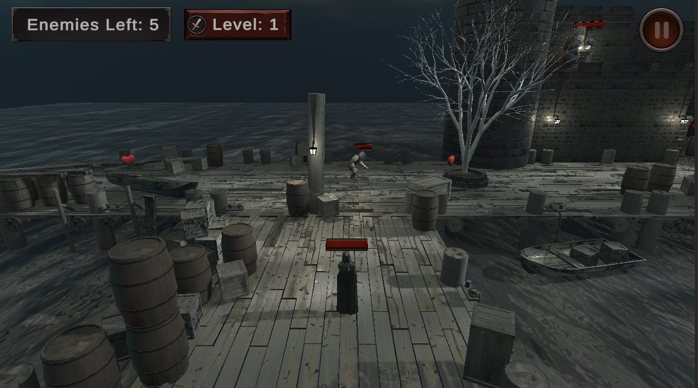

# Tower Escape 🏰🔥

**Tower Escape** is a **3D action game** built with [Unity](https://unity.com/).  
Your mission: **Defeat all enemy guards and reclaim the castle.**  
Lose all your health or fall into the sea, and it's game over!




## 🎯 Objective
- Defeat all enemy guards  
- Complete all **3 stages** to win and save the castle  


## 🕹 Gameplay
- Clear all enemies in each stage to unlock the next one  
- After completing Stage 3 – **you win!**  
- Avoid enemy fireballs – taking hits will reduce your health  
- Collect hearts to restore health  


## 🎮 Controls
- **Move:** `Arrow Keys` or `W / A / S / D`  
- **Shoot Fireballs:** `Spacebar`  


## 🤖 AI System
Enemy guards operate under **four behavior states**:  
1. **Idle** – Standing still or starting patrol. Transitions to **Pursue** when the player is detected.  
2. **Patrol** – Moving along predefined checkpoints. Transitions to **Pursue** when the player is detected.  
3. **Pursue** – Chasing the player until in attack range.  
4. **Attack** – Shooting fireballs at the player at a steady rate. Returns to **Idle** if the player leaves range.  

## 🛠 Requirements
- **Unity Version:** [2022.3.5f1](https://unity.com/releases/editor/whats-new/2022.3.5)  
*(Using other Unity versions may cause compatibility issues)*

## 🚀 How to Run
1. **Clone the repository**  
   ```bash
   git clone https://github.com/yourusername/TowerEscape.git
2. Open the project in Unity 2022.3.5f1
3. The first scene of the game is **MainMenu**, located in the `Assets/Scenes` folder.
4. Press Play in the Unity Editor or build the project for your platform
